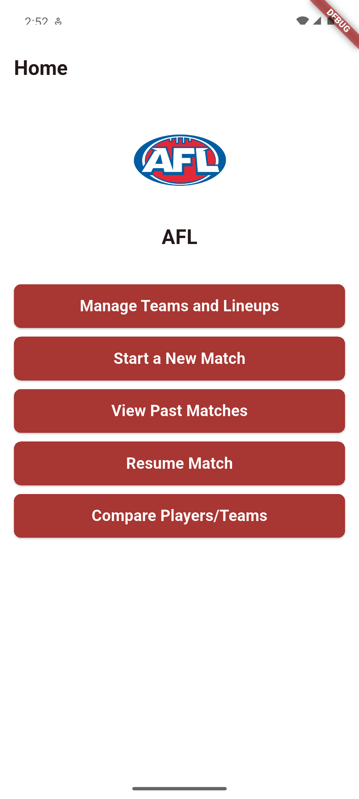
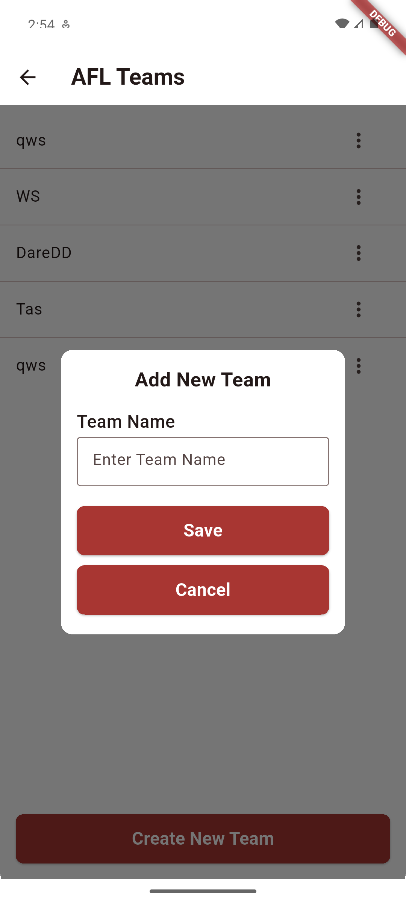

# AFL Stats iOS (Swift + Firebase) 🏉📱

[](#)
[](#)
[](#)
[](LICENSE)

An iOS app to **manage teams & lineups**, **start/resume matches**, do **live scoring**, review **past matches**, and **compare players/teams**.  
Built with **Swift (UIKit)** and **Firebase Realtime Database**.

---

## ✨ Features
- 👥 Teams & players management
- 🕹️ Start / Resume match
- ⏱️ Live scoring, timers, team stats
- 🗂️ Match history & details
- ⚖️ Compare players/teams

---

## 🧭 Screens / Controllers (high-level)
- **Home** – lists past matches from Firebase; opens details / resume.
- **NewMatch** – pick teams, start a new match.
- **Teams / AddTeam** – CRUD teams & players.
- **MatchScore** – live scoring, clocks, stats; writes to Firebase.
- **Loader** – transient loading while reading/writing.

---

## 🛠️ Requirements
- **Xcode 15+**, **iOS 16+**
- Firebase iOS SDK (Realtime Database)

---

## 🚀 Run locally
1. Open the project in Xcode (`.xcodeproj` or `.xcworkspace` if you use CocoaPods).
2. In Firebase Console create an iOS app and download **`GoogleService-Info.plist`**.  
   Add it to your Xcode target (Build Phases ➜ Copy Bundle Resources).
3. Build & run on the iPhone 14 simulator.

> **CocoaPods (optional)**  
> ```bash
> sudo gem install cocoapods
> pod install
> open *.xcworkspace
> ```

---

## 📸 Screenshots
> Put images in `screenshots/` with these exact names (or update the paths below).

<table>
  <tr>
    <td align="center"><div><sub>screenshots/home.png</sub></div></td>
    <td align="center"><div><sub>screenshots/create_team.png</sub></div></td>
    <td align="center"><div><sub>screenshots/match_score.png</sub></div></td>
  </tr>
</table>

---

## 🎥 Demo
> Place `media/demo.mp4`. If >100 MB use Git LFS (see below).

<video src="media/demo.mp4" width="720" controls></video>  
If the inline player doesn’t show: **[media/demo.mp4](media/demo.mp4)**

---

## 🧱 Project structure (example)
AFLStatsiOS/
├─ Sources / ViewControllers / (Home, Teams, AddTeam, NewMatch, MatchScore, Loader)
├─ Models /
├─ Services / Firebase/
├─ Resources / (Assets, Storyboards, GoogleService-Info.plist)
├─ screenshots/ # images for README
└─ media/ # demo.mp4 (use LFS if >100MB)


---

## 🔒 Notes
- Don’t commit service **account** keys or private secrets.
- Consider Firebase rules & auth if you publish the DB.

---

## 📝 License
MIT — see [LICENSE](LICENSE).
