# AFL Stats iOS (Swift + Firebase) 🏉📱

[](#)
[](#)
[](#)
[](LICENSE)

An iOS app to **manage teams & lineups**, **start/resume matches**, do **live scoring**, review **past matches**, and **compare players/teams**.  
Built with **Swift (UIKit)** and **Firebase Realtime Database**.

---

## ✨ Features
- 👥 Teams & players management
- 🕹️ Start / Resume match
- ⏱️ Live scoring, timers, team stats
- 🗂️ Match history & details
- ⚖️ Compare players/teams

---

## 🧭 Screens / Controllers (high-level)
- **Home** – lists past matches from Firebase; opens details / resume.
- **NewMatch** – pick teams, start a new match.
- **Teams / AddTeam** – CRUD teams & players.
- **MatchScore** – live scoring, clocks, stats; writes to Firebase.
- **Loader** – transient loading while reading/writing.

---

## 🛠️ Requirements
- **Xcode 15+**, **iOS 16+**
- Firebase iOS SDK (Realtime Database)

---

## 🚀 Run locally
1. Open the project in Xcode (`.xcodeproj` or `.xcworkspace` if you use CocoaPods).
2. In Firebase Console create an iOS app and download **`GoogleService-Info.plist`**.  
   Add it to your Xcode target (Build Phases ➜ Copy Bundle Resources).
3. Build & run on the iPhone 14 simulator.

> **CocoaPods (optional)**  
> ```bash
> sudo gem install cocoapods
> pod install
> open *.xcworkspace
> ```

---

## 📸 Screenshots
> Put images in `screenshots/` with these exact names (or update the paths below).

<table>
  <tr>
    <td align="center"><div><sub>home.png</sub></div></td>
    <td align="center"><div><sub>create_team.png</sub></div></td>
    <td align="center">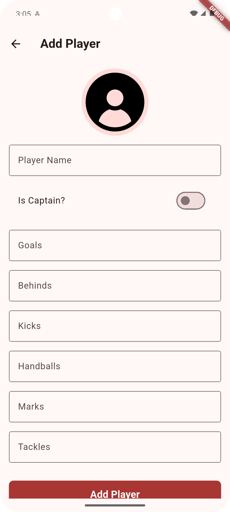<div><sub>create_player.png</sub></div></td>
    <td align="center">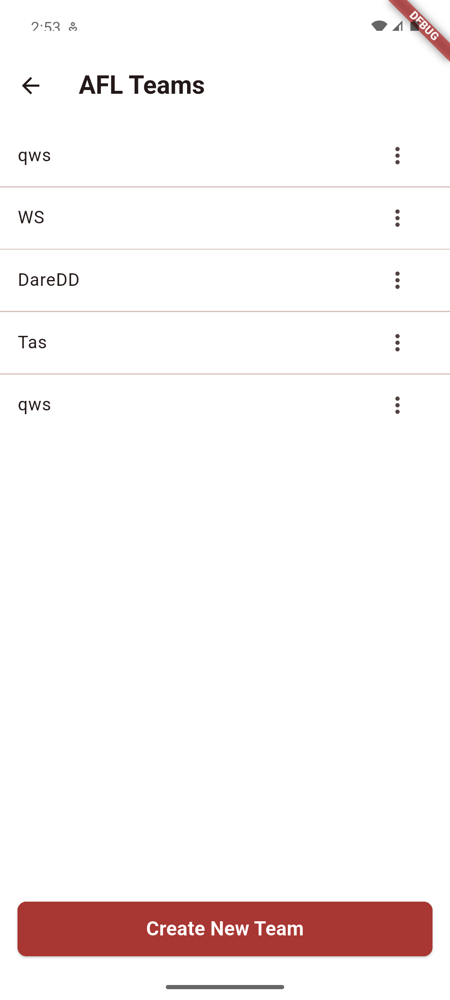<div><sub>manage_team_and_lineups.png</sub></div></td>
  </tr>
  <tr>
    <td align="center">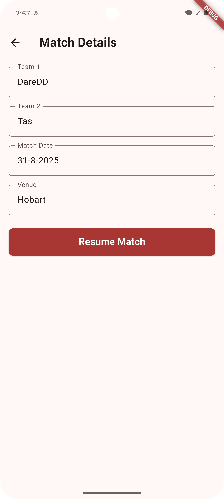<div><sub>create_match.png</sub></div></td>
    <td align="center">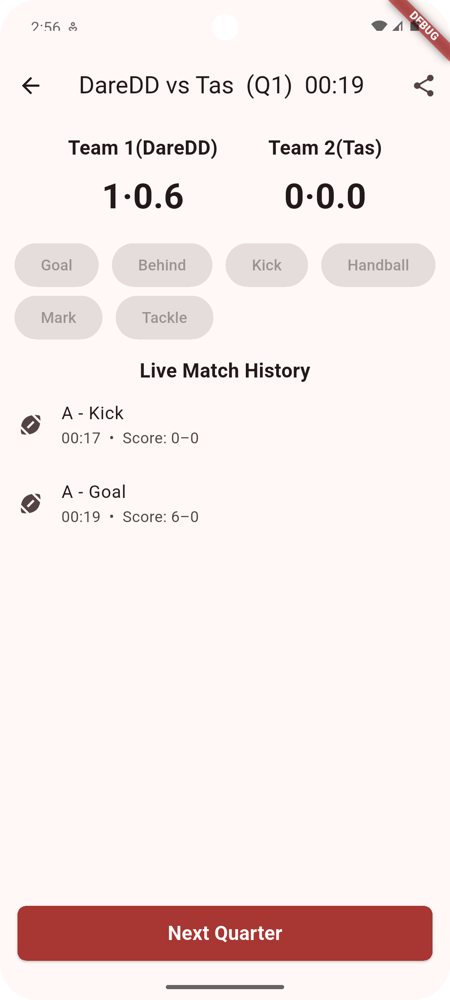<div><sub>match_preview.png</sub></div></td>
    <td align="center">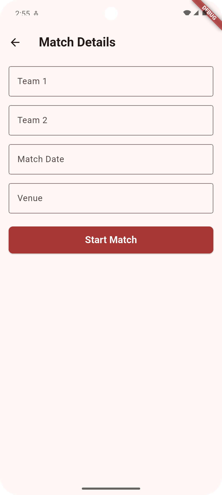<div><sub>match_details.png</sub></div></td>
    <td align="center">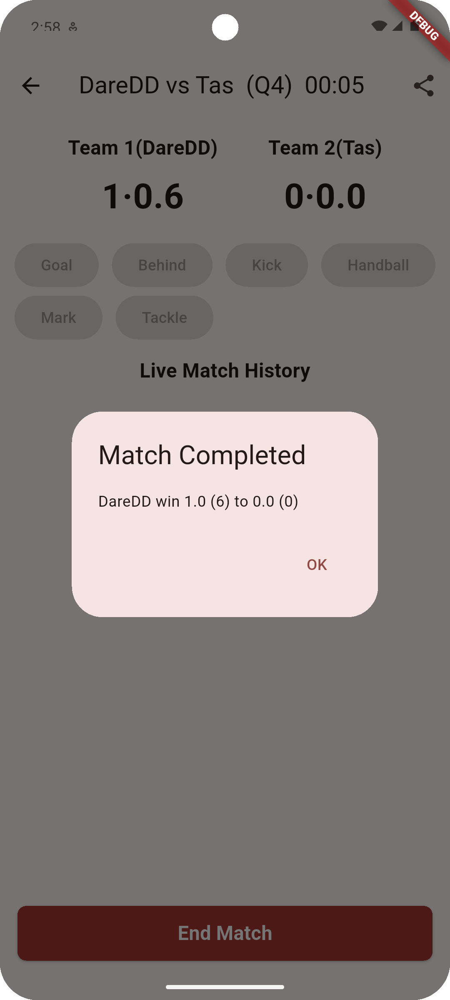<div><sub>match_completed.png</sub></div></td>
  </tr>
  <tr>
    <td align="center">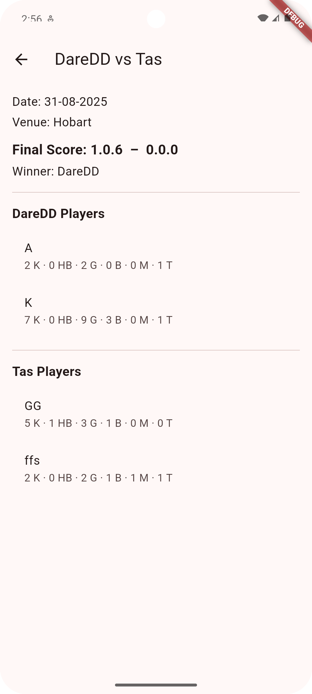<div><sub>matches_result.png</sub></div></td>
    <td align="center">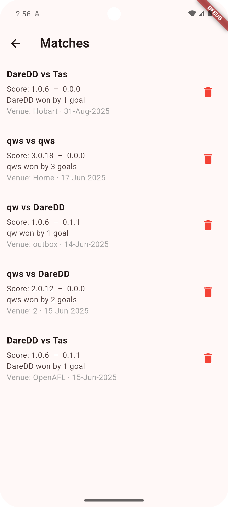<div><sub>recent_matches.png</sub></div></td>
    <td align="center">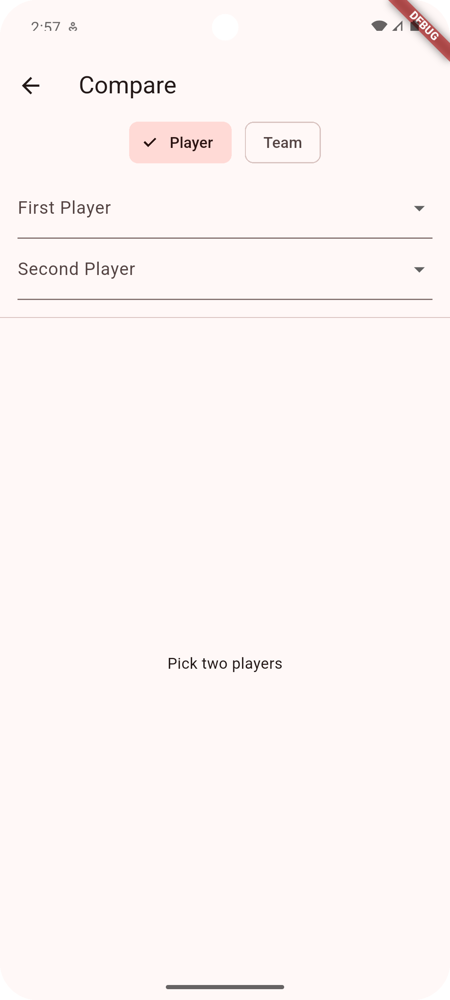<div><sub>compare_players_and_teams.png</sub></div></td>
    <td align="center">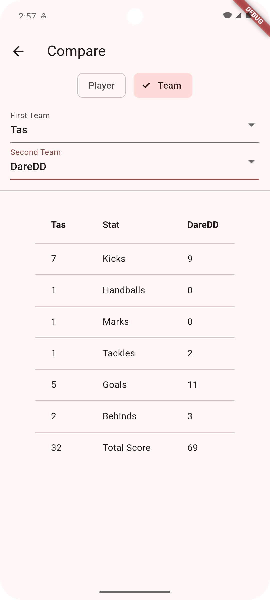<div><sub>teams_comparison.png</sub></div></td>
  </tr>
  <tr>
    <td align="center">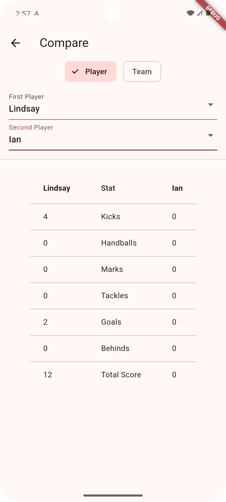<div><sub>players_comparison.png</sub></div></td>
    <td align="center">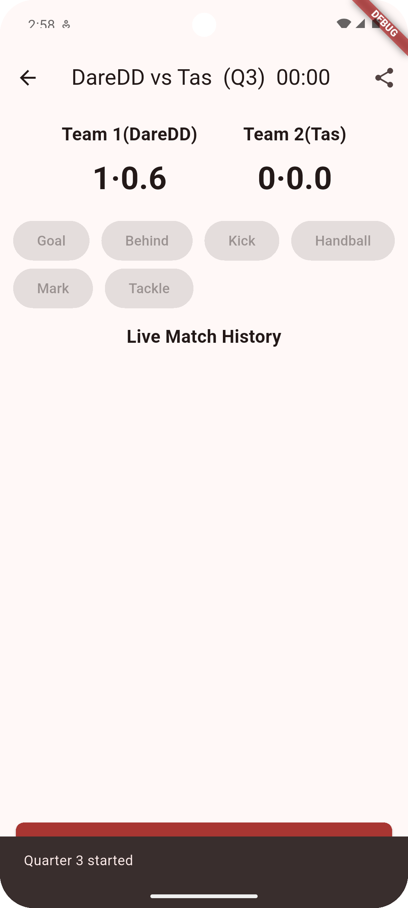<div><sub>4_quater_system.png</sub></div></td>
    <td align="center">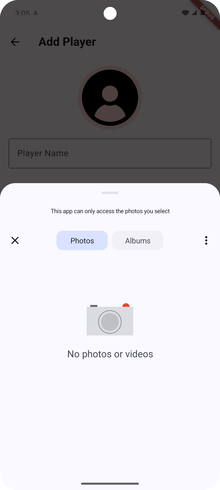<div><sub>add_profile_photo.png</sub></div></td>
    <td align="center">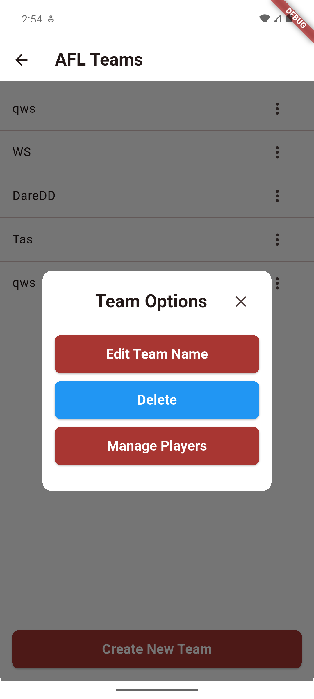<div><sub>delete_team.png</sub></div></td>
  </tr>
</table>

---

## 🎥 Demo
<!-- If you compressed to under 100 MB -->
<video src="media/afl-demo-720p.mp4" width="720" controls poster="screenshots/home.png"></video>

If the inline player doesn’t show, view/download directly: **[media/afl-demo-720p.mp4](media/afl-demo-720p.mp4)**

<!-- If you used Git LFS without compressing, change both links above to media/afl-demo.mp4 -->

---

```text
AFLStatsiOS/
├─ AFL.xcodeproj
├─ AFL.xcworkspace
├─ AFL/
│  ├─ Assets.xcassets/
│  ├─ Controllers/
│  │  ├─ HomeController.swift
│  │  ├─ NewMatchController.swift
│  │  ├─ TeamsController.swift
│  │  ├─ MatchScoreController.swift
│  │  └─ LoaderController.swift
│  ├─ Models/
│  │  ├─ Player.swift
│  │  ├─ Team.swift
│  │  ├─ Match.swift
│  │  └─ PlayerStats.swift
│  ├─ Notifications/
│  │  └─ Notifications.swift
│  ├─ Storyboards/
│  │  ├─ Base.lproj/
│  │  │  ├─ Main.storyboard
│  │  │  └─ LaunchScreen.storyboard
│  │  └─ TableCell/
│  │     ├─ AddTeamCell.swift
│  │     ├─ MatchesCell.swift
│  │     ├─ ScoreCardCell.swift
│  │     └─ …
│  ├─ Helpers/
│  │  └─ Extensions.swift
│  ├─ DatabaseManager/
│  │  └─ DatabaseManager.swift
│  ├─ Enums/
│  │  └─ Enum.swift
│  ├─ Info.plist
│  ├─ GoogleService-Info.plist   # add your own (not committed)
│  └─ …
├─ screenshots/                  # images for README
├─ media/                        # demo video (LFS or <100 MB)
├─ Podfile
├─ LICENSE
└─ README.md
```

---

## 🔒 Notes
- Don’t commit service **account** keys or private secrets.
- Consider Firebase rules & auth if you publish the DB.

---

## 📝 License
MIT — see [LICENSE](LICENSE).
